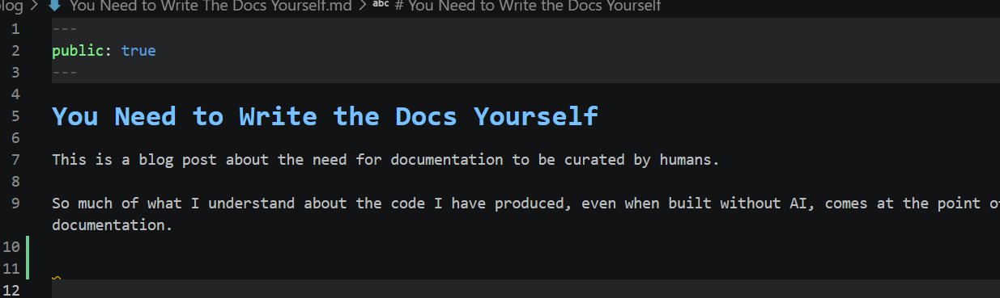

# You Need to Write the Docs Yourself

This is a blog post about the need for documentation to be curated by humans.

So much of what I understand about the code I have produced, even when built without AI, comes at the point of documentation.

